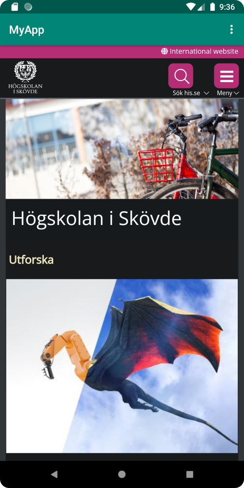
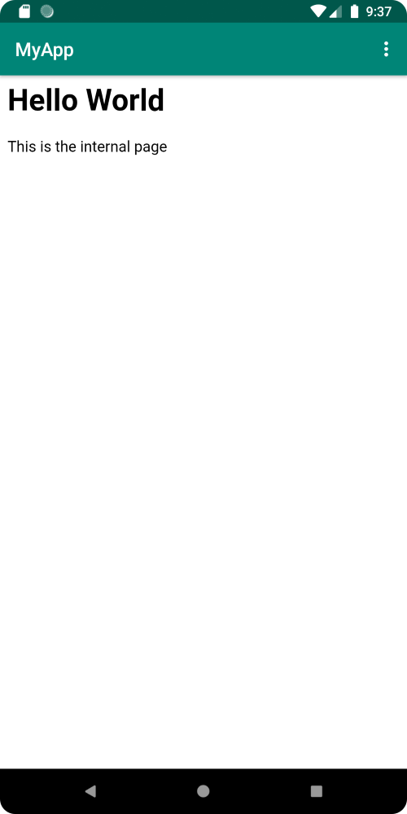

# Rapport

Det första steget var att ändra app-namnet. Detta gjordes genom att ändra texten i följande kod i strings.xml filen. Appen heter nu "MyApp".
```
<string name="app_name">MyApp</string>
```
Internet tillgång lades också till. Detta gjordes genom att lägga till följande kod i AndroidManifest.xml filen.

```
<uses-permission android:name="android.permission.INTERNET" />
```

Sedan skapades ett WebView element i activity_main.xml filen. WebView elementet har constraints som placerar den under app-baren. Den fick även ett unikt ID "web_view".  
Koden ser ut som följande:

````
<WebView
    android:id="@+id/web_view"
    android:layout_width="match_parent"
    android:layout_height="match_parent"
    android:layout_marginTop="55dp"
    app:layout_constraintBottom_toBottomOf="parent"
    app:layout_constraintEnd_toEndOf="parent"
    app:layout_constraintStart_toStartOf="parent"
    app:layout_constraintTop_toBottomOf="@+id/appBarLayout" />
````

Efter detta skapades en WebView variabel i MainActivity.java filen. Den används för att representera det tidigare skapat WebView elementet.  
Sedan skapades en WebViewClient som tillsattes till WebView variabeln. JavaScript exekvering tilläts även i WebViewClienten.  
Koden ser ut som följande:

````
private WebView myWebView;

@Override
    protected void onCreate(Bundle savedInstanceState) {
        myWebView = findViewById(R.id.web_view);
        myWebView.setWebViewClient(new WebViewClient());
        WebSettings webSettings = myWebView.getSettings();
        webSettings.setJavaScriptEnabled(true);
````

Sedan lades en HTML fil "internal.html" till inuti assets mappen. showExternalWebPage(), samt showInternalWebPage() metoderna utvecklades även.
När metoderna kallas laddas en sida till WebView variabeln. showExternalWebPage() laddar "his.se", medan showInternalWebPage() laddar "internal.html".  
Koden ser ut som följande:

````
public void showExternalWebPage(){
        myWebView.loadUrl("https://his.se");
    }

public void showInternalWebPage(){
        myWebView.loadUrl("file:///android_asset/internal.html");
    }
````

Till sist lades funktionalitet till dropdown menyn till. När "External web page" klickas kallas showExternalWebPage() metoden.
När "Internal web page" klickas kallas showInternalWebPage() metoden.  
Koden ser ut som följande:

````
@Override
    public boolean onOptionsItemSelected(MenuItem item) {
        if (id == R.id.action_external_web) {
            Log.d("==>","Will display external web page");
            showExternalWebPage();
            return true;
        }

        if (id == R.id.action_internal_web) {
            Log.d("==>","Will display internal web page");
            showInternalWebPage();
            return true;
        }
````

Den externa sidan ser ut som följande:  


Den interna sidan ser ut som följande:  


